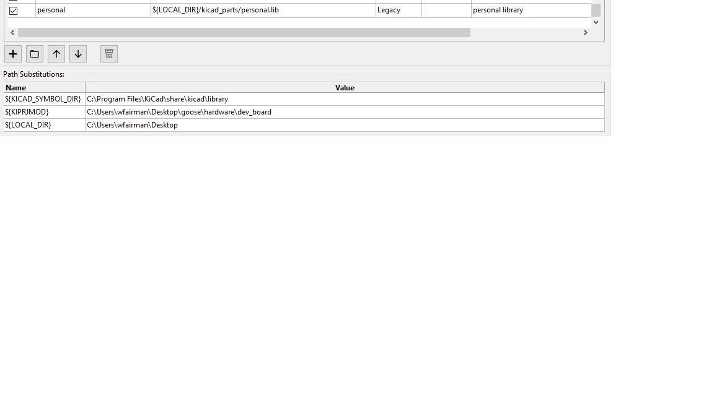

## Accessing Parts Folder 

For now, if you want to access the parts for this board, clone this [repo](https://github.com/wFairmanOlin/kicad_parts) and add a path pointing to `personal.lib` similar to this:

